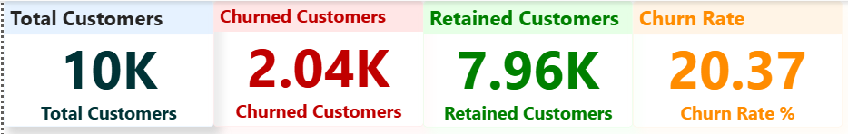
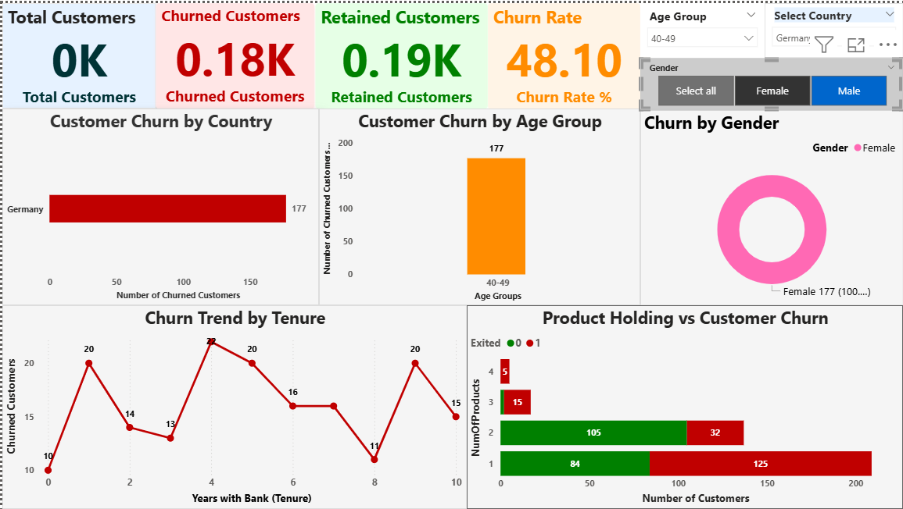

# 🏦 Bank Customer Churn Analysis

**Interactive Power BI Dashboard analyzing 10,000 bank customers to identify churn patterns and retention opportunities**


---

## 📊 Project Overview

This project analyzes customer churn for a European bank using Power BI to create an interactive dashboard that helps identify high-risk customer segments and provide actionable retention strategies.

**Key Metrics:**
- 📈 Total Customers: **10,000**
- 📉 Churned Customers: **2,037** (20.37%)
- ✅ Retained Customers: **7,963** (79.63%)
- 🎯 Analysis Dimensions: Geography, Age, Gender, Tenure, Products

---

## 🎯 Business Problem

The bank is experiencing a **20.37% annual churn rate**, resulting in significant revenue loss. Understanding why customers leave and identifying high-risk segments is critical for developing targeted retention strategies.

---

## 📁 Dataset

**Source:** [Kaggle - Bank Customer Churn Dataset](https://www.kaggle.com/datasets/shrutimechlearn/churn-modelling)

**Details:**
- **Size:** 10,000 customer records
- **Features:** 14 columns including demographics, account information, and products
- **Target Variable:** Exited (0 = Retained, 1 = Churned)

**Key Features:**
- Geography (France, Germany, Spain)
- Gender (Male, Female)
- Age (18-92 years)
- Tenure (0-10 years with bank)
- Balance, Credit Score, Products (1-4)

---

## 🔍 Key Findings

### 1️⃣ **Age Group Analysis**
- **40-49 age group** has the highest churn: **806 customers (39.5% of total churn)**
- Second highest: 50-59 with 487 churned customers
- Recommendation: Targeted retention campaigns for middle-aged customers

### 2️⃣ **Geographic Patterns**
- **Germany:** 814 churned (highest)
- **France:** 810 churned
- **Spain:** 413 churned (lowest)
- Insight: Germany and France need immediate attention

### 3️⃣ **Gender Distribution**
- **Female:** 55.9% of churned customers (1,138)
- **Male:** 44.1% of churned customers (899)
- Action: Gender-specific retention strategies

### 4️⃣ **Tenure Impact**
- **Year 0-1:** High churn (95-232 customers)
- **Year 1-2:** Peak churn period
- **After Year 3:** Churn stabilizes at lower levels
- Strategy: Focus on first 2 years (onboarding critical!)

### 5️⃣ **Product Holding**
- Customers with **1-2 products:** Higher churn
- Customers with **3-4 products:** Significantly lower churn
- Opportunity: Cross-selling reduces churn risk

---

## 💡 Recommendations

### 🎯 **Immediate Actions**

1. **Enhanced Onboarding Program**
   - Target: New customers (Year 0-2)
   - Impact: Reduce early-stage churn by 30%

2. **Age-Targeted Campaigns**
   - Focus: 40-49 age segment
   - Strategy: Personalized financial planning services

3. **Cross-Selling Initiative**
   - Goal: Increase products per customer from 1-2 to 3+
   - Expected: 20-25% churn reduction

4. **Geographic Strategy**
   - Priority: Germany & France markets
   - Action: Local retention teams, competitive analysis

### 📊 **Expected Business Impact**

- Potential Churn Reduction: 25-30%
- Customers Retained: ~500-600 annually
- Revenue Impact: Estimated $300,000 - $500,000 saved per year (Based on average customer revenue of $500-800 annually)

---

## 🛠️ Tools & Technologies

- **Power BI Desktop** - Dashboard creation & visualization
- **Power Query** - Data transformation & cleaning
- **DAX** - Calculated measures & KPIs
- **Markdown** - Documentation

**Skills Demonstrated:**
- Data Analysis & Visualization
- Business Intelligence
- Data Modeling
- Statistical Analysis
- Stakeholder Communication

---

## 📊 Dashboard Features

### **Interactive Elements:**
- ✅ 4 KPI Cards (Total, Churned, Retained, Churn Rate)
- ✅ 5 Visualizations:
  - Bar Chart: Churn by Country
  - Column Chart: Churn by Age Group
  - Donut Chart: Gender Distribution
  - Line Chart: Churn Trend by Tenure
  - Stacked Bar: Products vs Churn
- ✅ 3 Slicers (Geography, Gender, Age Group)
- ✅ Dynamic Filtering & Cross-Highlighting

### **Screenshots:**

**Full Dashboard:**


**KPI Cards:**


**Interactive Filtering:**


---

## 🚀 How to Use

### **Prerequisites:**
- Power BI Desktop (Free download from Microsoft)

### **Steps:**
1. Download `Bank_Churn_Dashboard.pbix` file
2. Open in Power BI Desktop
3. Explore interactive dashboard
4. Use slicers to filter by Geography, Gender, Age
5. Hover over charts for detailed tooltips

### **Navigation:**
- **Main Page:** Executive summary with all key metrics
- **Slicers (Right Panel):** Filter data dynamically
- **Charts:** Click to cross-filter other visuals

---

## 📂 Project Structure
```
bank-churn-analysis/
├── screenshots/
│   ├── 2_dashboard_full.png
│   ├── 3_kpi_cards.png
│   └── 6_dashboard_filtered.png
├── Bank_Churn_Dashboard.pbix
└── README.md
```

---

## 📈 Technical Implementation

### **Data Transformation (Power Query):**
- Created Age Group dimension using conditional columns
- Cleaned and validated data (no missing values)
- Data types configured correctly

### **DAX Measures:**
```dax
Total Customers = COUNTROWS(Churn_Modelling)

Churned Customers = CALCULATE(COUNTROWS(Churn_Modelling), 
                               Churn_Modelling[Exited] = 1)

Churn Rate % = DIVIDE([Churned Customers], [Total Customers], 0) * 100
```

### **Visualizations:**
- Color-coded by sentiment (Red = Churn, Green = Retained, Orange = Metric)
- Consistent formatting across all charts
- Professional color palette for business presentation

---

## 🎓 Learning Outcomes

Through this project, I developed skills in:

✅ **Data Analysis:** Identifying patterns and trends in customer behavior  
✅ **Business Intelligence:** Translating data into actionable insights  
✅ **Data Visualization:** Creating clear, impactful dashboards  
✅ **Power BI Mastery:** DAX, Power Query, interactive features  
✅ **Storytelling:** Communicating findings to stakeholders  
✅ **Problem Solving:** Addressing real-world business challenges  

---

## 🔗 Links

- **Dataset Source:** [Kaggle - Bank Customer Churn](https://www.kaggle.com/datasets/shrutimechlearn/churn-modelling)
- **LinkedIn:** [Nitesh Sharma](https://www.linkedin.com/in/nitesh-sharma-b55974232/)

---

## 👤 About Me

**Nitesh Sharma**  
Data Analyst | Power BI Specialist | Business Intelligence

I'm passionate about turning data into actionable insights. This project demonstrates my ability to analyze complex datasets, create interactive dashboards, and provide strategic business recommendations.

📧 **Email:** niteshsharma7496@gmail.com  
💼 **LinkedIn:** [linkedin.com/in/nitesh-sharma-b55974232](https://www.linkedin.com/in/nitesh-sharma-b55974232/)

---

## 📜 License

This project is available for educational and portfolio purposes. Feel free to use and learn from the code.

---

## 🙏 Acknowledgments

- Dataset provided by [Kaggle](https://www.kaggle.com/)
- Inspiration from banking industry best practices
- Power BI community for visualization techniques

---

**⭐ If you found this project helpful, please consider giving it a star!**

**📧 Questions or feedback? Feel free to reach out!**

---

*Last Updated: February 14, 2026*